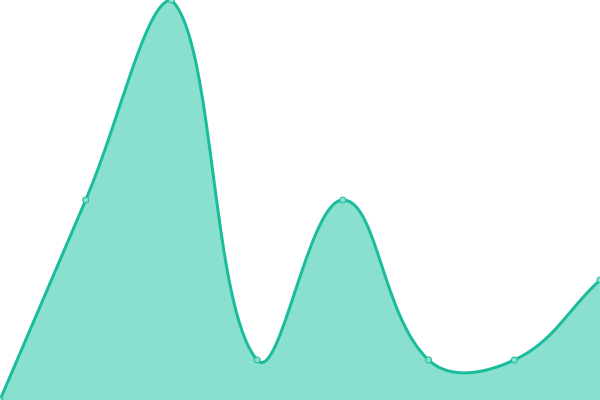
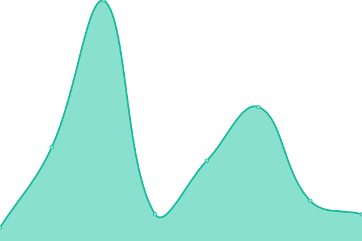

# [📈 Live Status](https://marcinbojko.github.io/upptime): <!--live status--> **🟧 Partial outage**

This repository contains the open-source uptime monitor and status page for [marcinbojko](https://bojko.dev), powered by [Upptime](https://github.com/upptime/upptime).

With [Upptime](https://upptime.js.org), you can get your own unlimited and free uptime monitor and status page, powered entirely by a GitHub repository. We use [Issues](https://github.com/marcinbojko/upptime/issues) as incident reports, [Actions](https://github.com/marcinbojko/upptime/actions) as uptime monitors, and [Pages](https://marcinbojko.github.io/upptime) for the status page.

<!--start: status pages-->
<!-- This summary is generated by Upptime (https://github.com/upptime/upptime) -->
<!-- Do not edit this manually, your changes will be overwritten -->
<!-- prettier-ignore -->
| URL | Status | History | Response Time | Uptime |
| --- | ------ | ------- | ------------- | ------ |
|  [Grafana](https://grafana.bojko.eu) | 🟥 Down | [grafana.yml](https://github.com/marcinbojko/upptime/commits/HEAD/history/grafana.yml) | 

 1276ms
     
 | 

<a href="https://marcinbojko.github.io/upptime/history/grafana">92.44%</a>
    

|  [Grafana-test](https://grafana-test.bojko.eu) | 🟥 Down | [grafana-test.yml](https://github.com/marcinbojko/upptime/commits/HEAD/history/grafana-test.yml) | 

 1368ms
     
 | 

<a href="https://marcinbojko.github.io/upptime/history/grafana-test">96.55%</a>
    

|  [Rancher](https://rancher.bojko.eu) | 🟩 Up | [rancher.yml](https://github.com/marcinbojko/upptime/commits/HEAD/history/rancher.yml) | 

 824ms
     
 | 

<a href="https://marcinbojko.github.io/upptime/history/rancher">100.00%</a>
    

|  [Supla Cloud](https://cloud.supla.org) | 🟩 Up | [supla-cloud.yml](https://github.com/marcinbojko/upptime/commits/HEAD/history/supla-cloud.yml) | 

 507ms
     
 | 

<a href="https://marcinbojko.github.io/upptime/history/supla-cloud">100.00%</a>
    

|  [bojko.dev](https://bojko.dev/) | 🟩 Up | [bojko-dev.yml](https://github.com/marcinbojko/upptime/commits/HEAD/history/bojko-dev.yml) | 

 503ms
     
 | 

<a href="https://marcinbojko.github.io/upptime/history/bojko-dev">99.45%</a>
    

|  [Google DNS 1](8.8.8.8) | 🟩 Up | [google-dns-1.yml](https://github.com/marcinbojko/upptime/commits/HEAD/history/google-dns-1.yml) | 

 4ms
     
 | 

<a href="https://marcinbojko.github.io/upptime/history/google-dns-1">100.00%</a>
    

|  [Cloudflare DNS](1.1.1.1) | 🟩 Up | [cloudflare-dns.yml](https://github.com/marcinbojko/upptime/commits/HEAD/history/cloudflare-dns.yml) | 

 3ms
     
 | 

<a href="https://marcinbojko.github.io/upptime/history/cloudflare-dns">100.00%</a>
    

<!--end: status pages-->

[**Visit our status website →**](https://marcinbojko.github.io/upptime)

## 📄 License

- Powered by: [Upptime](https://github.com/upptime/upptime)
- Code: [MIT](./LICENSE) © [marcinbojko](https://bojko.dev)
- Data in the `./history` directory: [Open Database License](https://opendatacommons.org/licenses/odbl/1-0/)
